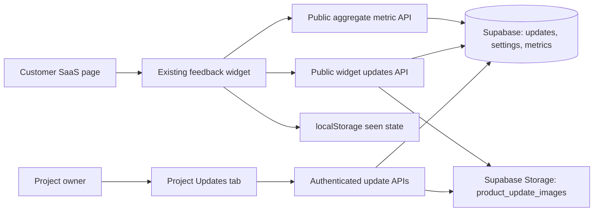

# Technical Design: Product Updates / What's New

## 1. Architecture

Product Updates extends the existing project dashboard, Supabase database, and widget runtime.



No second widget script, package, authentication system, scheduler, or analytics vendor is introduced.

## 2. Why `board_announcements` is not reused

`board_announcements` belongs to a public board and assumes:

- a board exists;
- content is visible on a public page;
- publication is immediate;
- there is no per-browser seen state;
- there is no in-app presentation configuration;
- there are no impression or CTA metrics.

Product Updates belongs directly to a project and needs drafts, scheduling, expiry, media, in-app display rules, and metrics. Reusing the table would couple unrelated lifecycle and RLS behavior.

The two models may gain an explicit “copy to public board” action later. Do not synchronize them in the MVP.

## 3. Database migration

Create:

```text
sql/028_product_updates.sql
```

This repository uses the ordered `sql/` chain as its canonical migration source rather than a second `supabase/migrations/` tree. If another migration lands after `027` before implementation begins, use the next available ordered number and update every reference in this folder. Read `docs/2026-06-09-migration-history-reconciliation.md` before applying the file to any linked environment.

Use existing `uuid_generate_v4()` and `public.touch_updated_at()` conventions.

### 3.1 `product_update_settings`

```sql
create table if not exists public.product_update_settings (
  project_id uuid primary key references public.projects(id) on delete cascade,
  enabled boolean not null default false,
  auto_show boolean not null default true,
  display_delay_ms integer not null default 1500
    check (display_delay_ms between 0 and 30000),
  theme text not null default 'auto'
    check (theme in ('auto', 'light', 'dark')),
  accent_color text,
  include_paths text[] not null default '{}',
  exclude_paths text[] not null default '{}',
  show_powered_by boolean not null default true,
  created_at timestamptz not null default now(),
  updated_at timestamptz not null default now(),
  check (accent_color is null or accent_color ~ '^#[0-9A-Fa-f]{3}([0-9A-Fa-f]{3})?$'),
  check (cardinality(include_paths) <= 10),
  check (cardinality(exclude_paths) <= 10)
);
```

API validation must additionally ensure every path:

- starts with `/`;
- is at most 120 characters;
- does not include a scheme, hostname, query, hash, wildcard, or regular expression syntax;
- is deduplicated.

Do not rely only on the SQL checks.

### 3.2 `product_updates`

```sql
create table if not exists public.product_updates (
  id uuid primary key default uuid_generate_v4(),
  project_id uuid not null references public.projects(id) on delete cascade,
  created_by uuid references auth.users(id) on delete set null,
  status text not null default 'draft'
    check (status in ('draft', 'published', 'archived')),
  version_label text,
  title text not null,
  summary text not null,
  highlights text[] not null default '{}',
  image_path text,
  cta_label text,
  cta_url text,
  published_at timestamptz,
  expires_at timestamptz,
  created_at timestamptz not null default now(),
  updated_at timestamptz not null default now(),
  check (length(trim(title)) between 1 and 120),
  check (length(trim(summary)) between 1 and 280),
  check (version_label is null or length(trim(version_label)) between 1 and 32),
  check (cardinality(highlights) <= 8),
  check (cta_label is null or length(trim(cta_label)) between 1 and 40),
  check (cta_url is null or length(trim(cta_url)) between 1 and 2048),
  check ((cta_label is null) = (cta_url is null)),
  check (status <> 'published' or published_at is not null),
  check (expires_at is null or published_at is null or expires_at > published_at)
);

create index if not exists idx_product_updates_project_created
  on public.product_updates(project_id, created_at desc);

alter table public.product_updates
  add constraint product_updates_project_id_id_key unique (project_id, id);

create index if not exists idx_product_updates_publication
  on public.product_updates(project_id, status, published_at desc)
  where status = 'published';
```

API validation must enforce:

- maximum 160 characters for every highlight;
- no empty highlight entries;
- image path belongs to the project/update prefix;
- CTA URL rules described below;
- plan limit before moving a record to `published`;
- scheduling entitlement before accepting a future `published_at`.

### 3.3 `product_update_metrics`

Store daily aggregates, not raw events.

```sql
create table if not exists public.product_update_metrics (
  project_id uuid not null references public.projects(id) on delete cascade,
  update_id uuid not null,
  metric_date date not null default current_date,
  event_type text not null
    check (event_type in ('impression', 'dismissal', 'cta_click')),
  count bigint not null default 0 check (count >= 0),
  created_at timestamptz not null default now(),
  updated_at timestamptz not null default now(),
  primary key (update_id, metric_date, event_type),
  foreign key (project_id, update_id)
    references public.product_updates(project_id, id) on delete cascade
);

create index if not exists idx_product_update_metrics_project_date
  on public.product_update_metrics(project_id, metric_date desc);
```

Add a service-role-only atomic increment function:

```sql
create or replace function public.increment_product_update_metric(
  p_project_id uuid,
  p_update_id uuid,
  p_event_type text,
  p_metric_date date default current_date
)
returns bigint
language plpgsql
security invoker
set search_path = pg_catalog
as $$
declare
  next_count bigint;
begin
  if p_event_type not in ('impression', 'dismissal', 'cta_click') then
    raise exception 'invalid product update metric';
  end if;

  if not exists (
    select 1 from public.product_updates
    where id = p_update_id and project_id = p_project_id
  ) then
    raise exception 'product update does not belong to project';
  end if;

  insert into public.product_update_metrics (
    project_id, update_id, metric_date, event_type, count
  ) values (
    p_project_id, p_update_id, p_metric_date, p_event_type, 1
  )
  on conflict (update_id, metric_date, event_type)
  do update set
    count = public.product_update_metrics.count + 1,
    updated_at = now()
  returning count into next_count;

  return next_count;
end;
$$;

revoke all on function public.increment_product_update_metric(uuid, uuid, text, date)
  from public, anon, authenticated;
grant execute on function public.increment_product_update_metric(uuid, uuid, text, date)
  to service_role;
```

The public HTTP metric endpoint calls this function through the server's admin client. `SECURITY INVOKER` is sufficient because the caller is the service role; do not convert it to `SECURITY DEFINER`. Browsers never call the RPC directly.

The composite foreign key is intentional: it makes a mismatched project/update metric impossible even if application validation regresses.

### 3.4 Atomic publish transition

Supabase JS does not make a multi-statement read/count/update transaction available through ordinary `.from()` calls. A Free project could otherwise race two publish requests and exceed its three-live-update limit.

Add a second service-role-only `SECURITY INVOKER` function:

```text
publish_product_update(
  p_project_id uuid,
  p_update_id uuid,
  p_published_at timestamptz,
  p_expires_at timestamptz,
  p_active_limit integer,
  p_allow_scheduling boolean
)
```

Inside one database transaction, the function must:

1. take a project-scoped transaction advisory lock;
2. lock the target update row and require the matching `project_id`;
3. use database time when `p_published_at` is null;
4. reject a future time when `p_allow_scheduling` is false;
5. validate expiry after publication;
6. when the requested publication is live now and `p_active_limit` is not null, count other records that are live now and reject when the limit is reached;
7. set `status = 'published'`, `published_at`, `expires_at`, and `updated_at`;
8. return the updated row or its ID.

The Route Handler derives `p_active_limit` and `p_allow_scheduling` from server-side entitlements; it never accepts them from the browser. Fully qualify application objects, pin `search_path` to `pg_catalog`, revoke EXECUTE from `PUBLIC`, `anon`, and `authenticated`, and grant EXECUTE only to `service_role`.

Do not implement publication as an unlocked count followed by a separate update.

### 3.5 RLS

Enable RLS on all three tables.

Policies:

- `product_update_settings`: owner SELECT, INSERT, UPDATE, DELETE through `projects.owner_user_id = auth.uid()`.
- `product_updates`: owner SELECT, INSERT, UPDATE, DELETE through the same ownership check.
- `product_update_metrics`: owner SELECT only.
- No anonymous table policies.
- No authenticated-user write policy for metrics.

Use separate policies per operation. Do not use one broad `FOR ALL` policy.

Supabase no longer guarantees that SQL-created tables are exposed to the Data API automatically. The migration must make privileges explicit and then verify them:

- `authenticated`: intended owner operations only, still constrained by the RLS policies above;
- `anon`: no table privileges;
- `service_role`: the table operations needed by the existing admin client and metric RPC.

Do not mistake table privileges for row authorization. Both the grant and the matching RLS policy are required for authenticated direct access.

Public widget reads go through a bounded server route using the service role. This makes publication filtering and origin checks explicit.

### 3.6 Triggers

Add `touch_updated_at` triggers for all three tables using the existing guarded/drop-and-create convention.

## 4. Storage

Create a public bucket:

```text
product_update_images
```

Limits:

- maximum object size: 2 MB;
- allowed MIME types: `image/jpeg`, `image/png`, `image/webp`;
- one active image per update;
- object path: `<project-id>/<update-id>/<random-uuid>.<extension>`.

Uploads and deletes go through authenticated dashboard API routes using the admin client. Do not expose a browser upload policy.

Public read is allowed because published dialogs need the image. Draft image URLs are unguessable UUID paths but must still be treated as public media.

When replacing an image:

1. validate and upload the new object;
2. update `product_updates.image_path`;
3. delete the old object;
4. if database update fails, delete the newly uploaded object.

Update `packages/dashboard/src/lib/feedback-storage-cleanup.ts` or rename/generalize it to clean Product Update images during project/account deletion. Do not leave orphan media.

## 5. Shared types and validation

Add a focused shared module:

```text
packages/shared/src/product-updates.ts
```

Export it from `packages/shared/src/index.ts`.

Types:

```ts
export type ProductUpdateStatus = 'draft' | 'published' | 'archived'
export type ProductUpdateTheme = 'auto' | 'light' | 'dark'
export type ProductUpdateMetricType = 'impression' | 'dismissal' | 'cta_click'

export interface ProductUpdateContent {
  id: string
  versionLabel?: string
  title: string
  summary: string
  highlights: string[]
  imageUrl?: string
  ctaLabel?: string
  ctaUrl?: string
  publishedAt: string
  expiresAt?: string
}

export interface ProductUpdatePublicSettings {
  autoShow: boolean
  displayDelayMs: number
  theme: ProductUpdateTheme
  accentColor: string
  includePaths: string[]
  excludePaths: string[]
  showPoweredBy: boolean
}

export interface ProductUpdatesPublicResponse {
  settings: ProductUpdatePublicSettings
  updates: ProductUpdateContent[]
}
```

Also export pure helpers with unit tests:

- `sanitizeProductUpdateInput`
- `sanitizeProductUpdateSettings`
- `deriveProductUpdateState`
- `isProductUpdateLive`
- `isProductUpdatePathEligible`
- `sanitizeProductUpdateCta`
- `buildProductUpdatesApiUrl`
- `buildProductUpdateMetricsApiUrl`

CTA rules:

- allow relative URLs starting with exactly one `/`;
- allow absolute `http:` and `https:` URLs;
- reject protocol-relative URLs (`//example.com`);
- reject credentials, `javascript:`, `data:`, `file:`, and other schemes;
- trim but do not silently reinterpret invalid values;
- publishing fails with a field error when invalid.

## 6. Entitlements

Extend `EntitlementSet` in `packages/shared/src/plans.ts`:

```ts
productUpdates: boolean
productUpdateActiveLimit: number | null
productUpdateScheduling: boolean
productUpdateAnalyticsDays: number
```

Values:

```ts
free: {
  productUpdates: true,
  productUpdateActiveLimit: 3,
  productUpdateScheduling: false,
  productUpdateAnalyticsDays: 7,
}

pro: {
  productUpdates: true,
  productUpdateActiveLimit: null,
  productUpdateScheduling: true,
  productUpdateAnalyticsDays: 90,
}
```

Continue to use `customBranding` to decide whether `show_powered_by` may be disabled.

Add server helpers in `packages/dashboard/src/lib/billing.ts` or a focused `product-update-entitlements.ts`:

- assert feature enabled;
- count currently live records excluding expired records;
- enforce live limit when publishing or restoring;
- reject future publication when scheduling is unavailable;
- force `show_powered_by = true` when custom branding is unavailable;
- limit metrics query start date.

## 7. Authenticated dashboard APIs

Use `getAuthedUserAndProject(projectId)` from `packages/dashboard/src/lib/api-auth.ts` for every owner route.

### 7.1 Collection

```text
GET  /api/projects/:projectId/updates
POST /api/projects/:projectId/updates
```

`GET` returns settings, update rows, and metrics already aggregated per update. Apply plan metrics-history cutoff.

`POST` creates a draft only. It must not accept `status: published`.

Request:

```json
{
  "versionLabel": "v2.4",
  "title": "Faster exports are here",
  "summary": "Large exports now run in the background.",
  "highlights": ["Export up to 10x more records"],
  "ctaLabel": "Try the new export",
  "ctaUrl": "/exports"
}
```

### 7.2 Single update

```text
GET    /api/projects/:projectId/updates/:updateId
PATCH  /api/projects/:projectId/updates/:updateId
DELETE /api/projects/:projectId/updates/:updateId
```

`PATCH` edits content only. Lifecycle changes use explicit action routes to prevent accidental publication from generic form saves.

`DELETE` removes the image object first or records a cleanup retry; then deletes the update. Prefer archive for live updates in the UI.

### 7.3 Lifecycle actions

```text
POST /api/projects/:projectId/updates/:updateId/publish
POST /api/projects/:projectId/updates/:updateId/archive
POST /api/projects/:projectId/updates/:updateId/restore
```

Publish request:

```json
{
  "publishedAt": "2026-07-18T12:00:00.000Z",
  "expiresAt": null
}
```

`publish` validates the complete record and entitlements. Immediate publication may omit `publishedAt`, which becomes server time.

`archive` sets status to archived and preserves metrics/content.

`restore` returns an archived record to draft. It does not republish automatically.

### 7.4 Settings

```text
GET   /api/projects/:projectId/updates/settings
PATCH /api/projects/:projectId/updates/settings
```

The server forces defaults and plan-dependent branding behavior.

### 7.5 Image

```text
POST   /api/projects/:projectId/updates/:updateId/image
DELETE /api/projects/:projectId/updates/:updateId/image
```

Use bounded multipart parsing. Validate declared MIME type and file signature where practical. Return the public image URL and stored path.

## 8. Public widget APIs

### 8.1 Fetch updates

```text
GET /api/widget/updates?projectKey=<browser-safe-project-key>
OPTIONS /api/widget/updates
```

Lookup follows the same hashed browser project-key path used by feedback submission.

Checks, in order:

1. rate limit;
2. validate bounded project key;
3. resolve project;
4. apply `widget_origin_restriction` using `isWidgetRequestOriginAllowed`;
5. load settings;
6. return empty updates when disabled;
7. query only live records;
8. map storage paths to public URLs;
9. sanitize the public response again.

Live query:

```text
status = published
published_at <= now
expires_at IS NULL OR expires_at > now
ORDER BY published_at DESC, id DESC
LIMIT 20
```

Response:

```json
{
  "settings": {
    "autoShow": true,
    "displayDelayMs": 1500,
    "theme": "auto",
    "accentColor": "#6366f1",
    "includePaths": ["/app"],
    "excludePaths": ["/app/auth"],
    "showPoweredBy": true
  },
  "updates": [
    {
      "id": "uuid",
      "versionLabel": "v2.4",
      "title": "Faster exports are here",
      "summary": "Large exports now run in the background.",
      "highlights": ["Export up to 10x more records"],
      "imageUrl": "https://...",
      "ctaLabel": "Try the new export",
      "ctaUrl": "/exports",
      "publishedAt": "2026-07-18T12:00:00.000Z"
    }
  ]
}
```

Headers:

```text
Access-Control-Allow-Origin: *
Access-Control-Allow-Methods: GET, OPTIONS
Access-Control-Allow-Headers: Content-Type
Cache-Control: public, max-age=60, stale-while-revalidate=300
Vary: Origin
ETag: <response hash>
```

Honor `If-None-Match` with `304`. Do not include owner IDs, project internal IDs, metrics, drafts, storage paths, or plan information.

Public fetch failure must be isolated from the feedback widget. Log only in debug mode.

### 8.2 Record metrics

```text
POST /api/widget/updates/events
OPTIONS /api/widget/updates/events
```

Request:

```json
{
  "projectKey": "browser-safe-project-key",
  "events": [
    { "updateId": "uuid", "type": "impression" }
  ]
}
```

Limits:

- maximum request body 8 KB;
- maximum 10 events per request;
- only three event types;
- update IDs must be UUIDs and belong to the resolved project;
- rate limit separately from feedback;
- apply origin restriction;
- do not trust a browser-supplied date;
- use the server's current UTC date;
- return `202` even though metrics are approximate.

The endpoint contains no viewer identity field.

## 9. Widget integration

### 9.1 Config

Extend `SavedWidgetConfig`, `WidgetConfig`, data-attribute input, sanitization, snippet generation, React props, and Vue props:

```ts
enableUpdates?: boolean
updatesApiUrl?: string
updatesEventsApiUrl?: string
```

Website attribute:

```html
data-enable-updates="true"
```

Only emit it when true. Build default URLs from the configured app origin.

Do not fetch Product Updates unless `enableUpdates === true`.

### 9.2 Runtime module boundaries

Do not keep expanding the already-large `widget.ts` with all logic.

Add:

```text
packages/widget/src/product-updates.ts
packages/widget/src/product-update-storage.ts
```

Responsibilities:

- `product-updates.ts`: fetch, eligibility, modal DOM, focus behavior, CTA, metrics queue, trigger binding.
- `product-update-storage.ts`: safe localStorage read/write/prune and in-memory fallback.
- `widget.ts`: initialize/destroy controller and coordinate feedback/update overlay ownership.
- `styles.css`: namespaced `.fb-update-*` styles only.

The localStorage namespace uses the last 12 characters of the browser-safe project key. Key rotation therefore resets local seen state by design. Never store the full key, host URL, or viewer data in the local state.

Customer content must be assigned through `textContent` or DOM text nodes. Static trusted icons may use constant SVG strings.

### 9.3 Overlay coordination

Create an internal overlay coordinator shared by feedback and updates.

Rules:

- automatic update open never closes feedback;
- automatic update waits until feedback closes;
- clicking the feedback launcher while an update is open closes the update, then opens feedback;
- manual `openUpdates()` returns `false` when feedback is open;
- destroying a widget closes its owned overlay and removes listeners/timers;
- body scroll restoration must preserve the preexisting value.

### 9.4 Public methods

```ts
openUpdates(): Promise<boolean>
closeUpdates(): void
getUnreadUpdateCount(): number
refreshUpdates(): Promise<void>
```

`refreshUpdates()` supports host SPA integrations without monkeypatching `history.pushState`. It re-fetches only when cache is stale, always re-evaluates the current pathname, and never auto-shows more than once per full page load.

Listen for:

- `popstate` to re-evaluate paths;
- `feedbacks:updates:refresh` custom window event to call `refreshUpdates()`;
- clicks on `[data-feedbacks-updates-trigger]`.

Do not monkeypatch the browser History API in the MVP.

### 9.5 Browser events

Dispatch non-sensitive integration events:

```text
feedbacks:updates:ready
feedbacks:updates:shown
feedbacks:updates:dismissed
feedbacks:updates:cta-clicked
```

Event detail may contain only `projectKeySuffix`, `updateId`, and `manual`. Do not include full project keys, user data, page URL, or update body.

Use only the last four project-key characters for `projectKeySuffix`, matching the dashboard's existing redaction convention.

## 10. Dashboard integration

Add `updates` to:

- `TabId` and tab list in `project-tabs.tsx`;
- `ProjectSection` and project menu in `project-flow-nav.tsx`;
- project-tab rendering and navigation tests;
- product-tour/tutorial definitions only after the core feature is stable.

New component folder:

```text
packages/dashboard/src/components/product-updates/
  ProductUpdatesTab.tsx
  ProductUpdateList.tsx
  ProductUpdateEditor.tsx
  ProductUpdatePreview.tsx
  ProductUpdateSettings.tsx
  ProductUpdateMetrics.tsx
  product-update-client.ts
```

Keep API calls and response parsing in `product-update-client.ts`. Components receive typed models and do not repeat sanitization rules.

The preview uses the same content order, spacing tokens, and color-derivation rules as the widget. It is a React preview, not a second independent design.

## 11. Security

- No raw HTML, Markdown, scripts, iframes, or custom CSS.
- All content length limits enforced server-side.
- Public output is allowlisted field by field.
- Owner routes authenticate and verify project ownership.
- Update IDs are always constrained by both `project_id` and `id`.
- Public routes use bounded request bodies and rate limiting.
- Origin restriction behavior matches feedback submission.
- CTA schemes are strictly allowlisted.
- External links use `noopener noreferrer`.
- Images are MIME and size limited.
- Storage object paths are generated by the server.
- Metrics are aggregate and contain no viewer identifiers.
- Database metrics RPC is service-role only.
- Error responses do not reveal whether another user's update exists.
- Free/Pro behavior is enforced on the server.

## 12. Performance

Widget budgets:

- no update fetch when disabled;
- one update fetch per initialized project when enabled;
- at most 20 update records;
- public response target under 50 KB excluding images;
- image is lazy-loaded and limited to 2 MB;
- update code should keep total widget target at or below 16 KB gzipped;
- existing hard CI limit remains 20 KB gzipped;
- metrics use `sendBeacon` when available or `fetch(..., { keepalive: true })` fallback;
- metrics failure never retries indefinitely;
- all timers, listeners, and pending requests are cleaned on `destroy()`.

If the widget exceeds the target, first simplify UI code and CSS. Do not raise the hard limit without explicit approval.

## 13. Caching and publication consistency

The public endpoint may cache for 60 seconds. Therefore:

- publication, archive, expiry, and scheduling can take up to 60 seconds to appear externally;
- dashboard copy must say “usually visible within a minute”;
- owner APIs use `cache: no-store`;
- widget `refreshUpdates()` may append a cache-busting query only after an explicit host call, not on normal page load;
- ETag should avoid downloading unchanged payloads.

No cron is required for scheduled updates. Eligibility is calculated from timestamps at read time.

## 14. Database types and schema verification

After applying the migration to the intended Supabase environment:

```bash
pnpm supabase:types
pnpm supabase:check
```

Update `scripts/check-supabase-schema.mjs`:

- required `product_update_settings` columns;
- required `product_updates` columns;
- required `product_update_metrics` columns;
- required `product_update_images` bucket;
- both service-only functions must be verified without mutating production data; keep them out of generic read-only probes and verify their existence, privileges, and behavior in migration integration tests.

Do not hand-edit generated `database.types.ts` after generation.

## 15. Documentation updates when implemented

Update only after the feature works:

- `docs/product-status.md`
- `docs/DEPLOYMENT.md`
- `packages/dashboard/src/lib/docs-content.ts`
- `README.md`
- public limits/security/customization guides
- `.env.local.example` only if a new environment variable is actually needed

No new external service or environment variable is required by this design.
